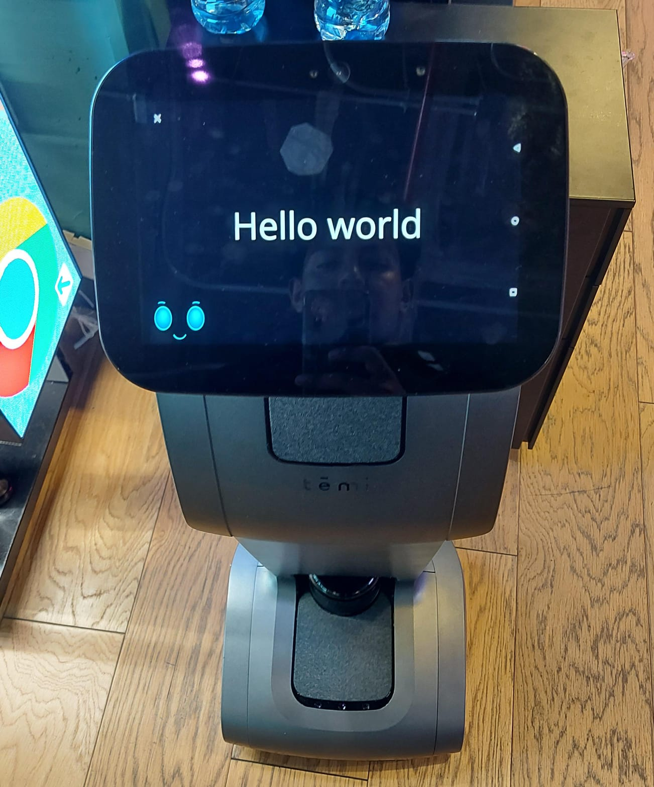

# SDK Temi

Temi Robot SDK to interact with TemiRobot, where you can start with interface Hello World in Android Studio using Kotlin

## SDK information

If you need to integrate this project with our SDK, you can find detailed information and documentation on our [SDK documentation page](https://github.com/robotemi/sdk).


## Init Project

To get started with the SDK, follow these steps:

1. You can interact with samples [Samples](https://github.com/robotemi/sdk/tree/master/sample) to playwith Temi.

2. Choose Android Version accordding with Temi, for example, in this project using API23("Marshmallow";Android 6.0) and Build configuration language with Kotlin DSL.


3. Follow the installation instructions in the SDK documentation to set up the SDK in your project.

In the file build.graddle.kts (Module:app) include SDK Temi

```bash
dependencies {
...
implementation("com.robotemi:sdk:1.131.4")
...
}
```

## Basic Example

In the file MainActivity.kt include the next libraries

```bash
import com.robotemi.sdk.Robot
import com.robotemi.sdk.TtsRequest
```
 And the logical code include a simple example to interact with Temi

 ```bash
 
 class MainActivity : ComponentActivity() {
    override fun onCreate(savedInstanceState: Bundle?) {
        super.onCreate(savedInstanceState)
        setContent {
            HelloWorldTheme {
                // A surface container using the 'background' color from the theme
                Surface(
                    modifier = Modifier.fillMaxSize(),
                    color = MaterialTheme.colorScheme.background
                ) {
                    Greeting("Android")
                }
            }
        }

        // Inicializa el SDK de Temi
        val robot = Robot.getInstance()

        // Hacer que el robot diga "Hello world"
        val ttsRequest = TtsRequest.create("Hello world", true)
        robot.speak(ttsRequest)
    }
}

@Composable
fun Greeting(name: String, modifier: Modifier = Modifier) {
    Text(
        text = "Hello $name!",
        modifier = modifier
    )
}

@Preview(showBackground = true)
@Composable
fun GreetingPreview() {
    HelloWorldTheme {
        Greeting("Android")
    }
}
 
 ```
# Successful

| Result 1 | Result 2 |
| --------- | --------- |
| {width=384px height=864px} | {width=384px height=864px} |


